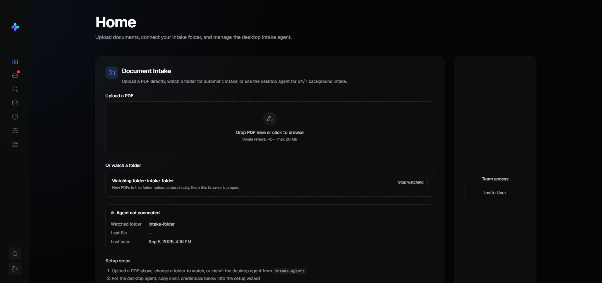

# AI-Powered Healthcare Workflow Platform

A full-stack healthcare workflow automation platform designed to digitize document-intensive administrative processes and transform unstructured clinical documents into actionable workflow records.

> **Note:** This repository is a public portfolio representation of the project. Source code and implementation details are not included due to confidentiality and proprietary restrictions.

## Overview

Healthcare organizations often rely on document-heavy workflows involving referrals, forms, reports, and other clinical communications. Processing these documents manually can require significant administrative effort and coordination across multiple stakeholders.

I designed and developed a full-stack platform that uses large language models and structured extraction techniques to automate portions of this workflow.

The platform processes incoming documents, extracts structured information, routes work through configurable workflows, and provides role-based interfaces for operational and domain-specific users.

## Key Capabilities

* **AI document processing** — Classifies and processes incoming unstructured documents using LLM-powered pipelines.
* **Structured extraction** — Converts relevant document content into structured records using prompt engineering and schema-based extraction.
* **Workflow automation** — Routes processed information through configurable approval and task workflows.
* **Role-based dashboards** — Provides different interfaces and actions based on user roles and responsibilities.
* **Automated record creation** — Converts extracted information into actionable downstream records.
* **Third-party integrations** — Connects backend services and external APIs to support end-to-end workflow execution.
* **Auditability** — Tracks workflow actions and state transitions throughout the processing lifecycle.

## Architecture

At a high level, the system follows a document-to-workflow pipeline:

```text
Incoming Document
       │
       ▼
Document Processing
       │
       ▼
LLM Classification
       │
       ▼
Structured Extraction
       │
       ▼
Validation / Processing
       │
       ▼
Workflow Engine
       │
       ├───────────────┐
       ▼               ▼
Operational       Domain-Specific
Dashboard             Dashboard
       │               │
       └───────┬───────┘
               ▼
      Downstream Actions
               │
               ▼
       External Services
```

A higher-level architecture diagram is available in [`docs/architecture.png`](docs/architecture.png).

## AI / LLM Pipeline

The document-processing pipeline was designed around two primary stages:

### 1. Classification

Incoming documents are analyzed and categorized so that the appropriate workflow can be selected.

### 2. Structured Extraction

Relevant information is extracted from unstructured documents into predefined fields and schemas.

The extraction pipeline achieved **90%+ field-level accuracy** across the evaluated fields.

The system was designed to prioritize structured, predictable outputs rather than relying on free-form model responses.

## Workflow Automation

After document processing, extracted information can initiate downstream workflow actions.

The platform supports concepts such as:

* Workflow states
* Approval / rejection actions
* Task assignment
* Role-based access
* Status transitions
* Record creation
* External service calls

This allowed document processing to become an actionable operational workflow rather than simply an OCR or text-extraction system.

## Technology

**Frontend**

* React
* JavaScript

**Backend**

* Python
* FastAPI

**AI / ML**

* Large Language Models
* Prompt Engineering
* Structured Extraction

**Data**

* SQL
* Relational data modeling

**Integrations**

* REST APIs
* Backend services
* Third-party APIs

## Impact

The platform was deployed with early customers and was designed to reduce administrative workload associated with document-intensive processes.

Early deployment resulted in an estimated **~50% reduction in administrative workload** for the targeted workflows.

The system also achieved **90%+ field-level accuracy** on the evaluated structured extraction tasks.

## Demo

A short product demonstration is available below.

[`demo/demo.mp4`](demo/demo.mp4)

The demonstration uses synthetic / non-sensitive data and focuses on the product workflow rather than proprietary implementation details.

## Screenshots

### Dashboard



### Document Processing


### Workflow


## Engineering Highlights

Some of the main engineering challenges involved:

* Designing reliable structured outputs from LLMs
* Handling unstructured and inconsistent document formats
* Connecting AI processing to deterministic backend workflows
* Designing role-based interfaces around different operational responsibilities
* Integrating external APIs into downstream workflow execution
* Building an architecture capable of supporting additional document types and workflows

## Confidentiality

This project involved proprietary software and workflows. As a result, the public repository intentionally excludes:

* Source code
* Proprietary prompts
* Production credentials
* Private API details
* Customer information
* Protected health information (PHI)
* Internal infrastructure details
* Proprietary business logic

The screenshots and demonstration included in this repository are intended solely to demonstrate the general functionality and engineering scope of the system.

## Project Status

**Deployed / In active development**

This repository serves as a portfolio overview rather than the production source repository.
